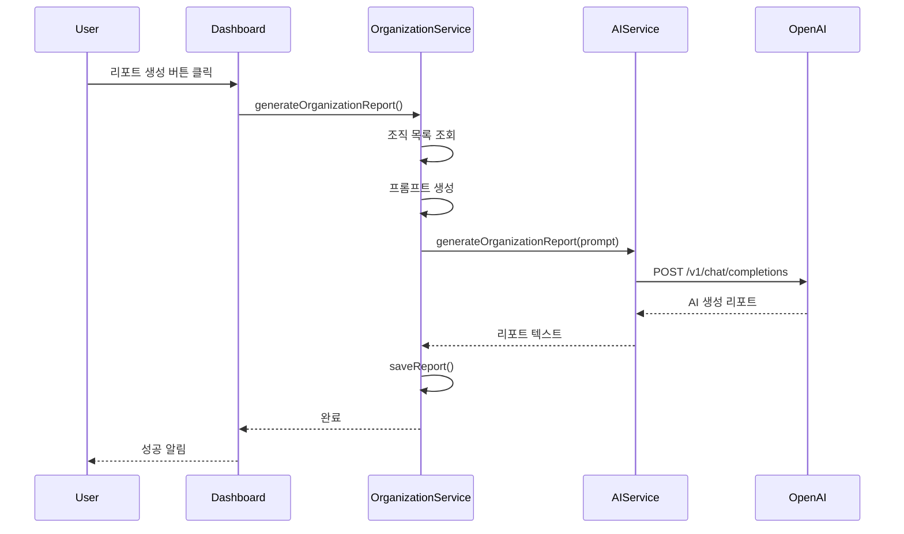

# OpenAI API 연동 가이드

## 개요

조직 동향 리포트 생성 기능에 OpenAI GPT-4o-mini 모델을 연동했습니다.

## 설정 방법

### 1. OpenAI API 키 발급

1. https://platform.openai.com 접속
2. 로그인 또는 회원가입
3. API Keys 메뉴 선택
4. "Create new secret key" 클릭
5. API 키 복사 (sk-로 시작하는 문자열)

### 2. 환경 변수 설정

`.env` 파일에 API 키 추가:

```bash
# .env 파일
VITE_OPENAI_API_KEY=sk-...your-actual-api-key...
```

### 3. 개발 서버 재시작

```powershell
# 기존 서버 중지 (Ctrl+C)
# 서버 재시작
npm run dev
```

## 사용 방법

### 1. 관심 조직 등록

1. 애플리케이션 실행
2. 네비게이션에서 "리포트 설정" 클릭
3. 조직 추가 (기업/관공서/대학)

### 2. 리포트 생성

1. 대시보드로 이동
2. "📊 최신 리포트 생성" 버튼 클릭
3. AI가 자동으로 분석하여 리포트 생성 (약 10-30초 소요)

## 작동 원리



## 구현 내용

### 새로 추가된 파일

1. **`src/services/ai.service.ts`** (93 lines)
   - OpenAI API 클라이언트
   - GPT-4o-mini 모델 사용
   - 에러 핸들링 및 fallback 로직

2. **`docs/AI_INTEGRATION.md`** (이 파일)
   - 설정 가이드
   - 사용 방법
   - 트러블슈팅

### 수정된 파일

1. **`src/services/organizationReport.service.ts`**
   - AIService 통합
   - 실제 AI 리포트 생성 로직 추가
   - 에러 발생 시 프롬프트 미리보기 fallback

2. **`src/pages/Dashboard.tsx`**
   - 리포트 생성 버튼 추가
   - AI 리포트 생성 및 저장 로직

3. **`.env.example`**
   - `VITE_OPENAI_API_KEY` 추가

4. **`docs/ORGANIZATION_REPORT.md`**
   - AI 연동 정보 업데이트
   - 비용 정보 추가
   - 트러블슈팅 섹션 추가

## API 모델 정보

### GPT-4o-mini

- **성능**: 빠르고 비용 효율적
- **토큰 제한**: 최대 128K 입력 토큰
- **응답 품질**: 일반적인 비즈니스 리포트에 충분
- **가격**: 
  - Input: $0.150 / 1M tokens
  - Output: $0.600 / 1M tokens

### 예상 사용량

- 조직 10개 리포트: 약 2,000-3,000 tokens (입력+출력)
- 예상 비용: $0.01-0.02 per report
- 월 100개 리포트: 약 $1-2

## 보안 고려사항

### API 키 관리

- ✅ `.env` 파일에 저장 (Git에서 제외됨)
- ✅ `VITE_` 접두사 사용 (Vite 환경변수)
- ⚠️ 클라이언트 사이드에서 직접 호출 (프로덕션에서는 백엔드 권장)

### 권장 사항 (프로덕션)

1. **Supabase Edge Function 사용**
   - API 키를 서버 사이드에 저장
   - 클라이언트에서 Edge Function 호출
   - Supabase Secrets에 API 키 저장

2. **Rate Limiting**
   - 사용자당 일일 리포트 생성 횟수 제한
   - 비용 초과 방지

3. **사용량 모니터링**
   - OpenAI 대시보드에서 사용량 추적
   - 예산 알림 설정

## 트러블슈팅

### 문제: API 키 오류

**증상**:
```
Error: OpenAI API 키가 설정되지 않았습니다
```

**해결**:
1. `.env` 파일 확인
2. `VITE_OPENAI_API_KEY=sk-...` 형식 확인
3. 개발 서버 재시작

### 문제: 401 Unauthorized

**증상**:
```
OpenAI API 오류: Incorrect API key provided
```

**해결**:
1. API 키 재확인
2. OpenAI 대시보드에서 키 유효성 검증
3. 필요시 새 API 키 발급

### 문제: 429 Rate Limit

**증상**:
```
OpenAI API 오류: Rate limit exceeded
```

**해결**:
1. OpenAI 대시보드에서 사용량 확인
2. 요금제 업그레이드 고려
3. 잠시 후 재시도

### 문제: AI 생성 실패 (Fallback)

**증상**:
- 프롬프트 미리보기만 표시됨
- "[AI 리포트 생성 실패 - 프롬프트 미리보기]" 메시지

**원인**:
- 네트워크 오류
- API 할당량 초과
- OpenAI 서비스 장애

**해결**:
1. 네트워크 연결 확인
2. OpenAI Status 페이지 확인 (https://status.openai.com)
3. 잠시 후 재시도

## 테스트 체크리스트

- [ ] `.env` 파일에 API 키 설정
- [ ] 개발 서버 재시작
- [ ] 리포트 설정에서 조직 등록
- [ ] 대시보드에서 리포트 생성 버튼 클릭
- [ ] AI 리포트 생성 확인 (10-30초 소요)
- [ ] 생성된 리포트 내용 확인
- [ ] 리포트가 목록에 표시되는지 확인

## 참고 자료

- [OpenAI API Documentation](https://platform.openai.com/docs/introduction)
- [GPT-4o-mini Model Card](https://platform.openai.com/docs/models/gpt-4o-mini)
- [OpenAI Pricing](https://openai.com/api/pricing/)
- [Rate Limits](https://platform.openai.com/docs/guides/rate-limits)
