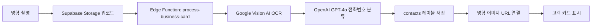
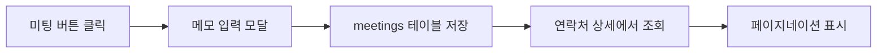
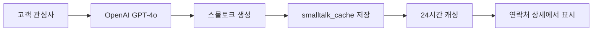
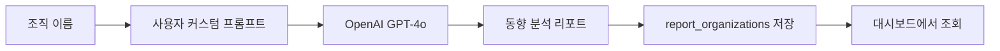
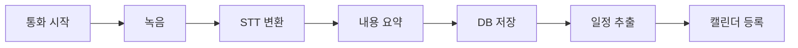

# 분석/설계서 (Story/Design)
**업데이트: 2025년 10월 28일**

## 1. 사용자 스토리

### 영업사원 스토리

1. 명함 등록 ✅ (구현 완료)
   ```
   As a 영업사원
   I want to 명함을 촬영하여 고객 정보를 등록하고
   So that 수작업 입력 없이 고객 DB를 구축할 수 있다
   ```
   - **구현 내역**: Google Vision AI OCR, AI 기반 전화번호 자동 분류, 명함 이미지 저장

2. 고객 관리 ✅ (구현 완료)
   ```
   As a 영업사원
   I want to 고객 정보를 쉽게 편집하고 관리하며
   So that 최신 정보를 유지하고 관심사를 기록할 수 있다
   ```
   - **구현 내역**: 전체 필드 편집, 관심사 관리, 연락처 검색/필터링

3. 기업동향 파악 ✅ (구현 완료)
   ```
   As a 영업사원
   I want to 관심 조직의 최신 동향을 AI 기반으로 분석받고
   So that 고객과의 대화 준비와 영업 전략 수립에 활용할 수 있다
   ```
   - **구현 내역**: OpenAI GPT-4o 기반 기업동향 리포트, 사용자별 프롬프트 커스터마이징

4. 스몰토크 준비 ✅ (구현 완료)
   ```
   As a 영업사원
   I want to 고객별 맞춤 대화 소재를 AI로 생성받고
   So that 자연스러운 관계 형성과 라포 구축을 할 수 있다
   ```
   - **구현 내역**: 고객 관심사 기반 스몰토크 소재 자동 생성, 캐싱 시스템

5. 미팅 기록 ✅ (구현 완료)
   ```
   As a 영업사원
   I want to 고객과의 미팅 날짜와 메모를 간편하게 기록하고
   So that 고객 관리 이력을 체계적으로 유지할 수 있다
   ```
   - **구현 내역**: 원클릭 미팅 기록, 메모 작성, 페이지네이션

6. 통화 관리 🔄 (Phase 3 - 계획)
   ```
   As a 영업사원
   I want to 통화 내용이 자동으로 기록되고 요약되어
   So that 중요한 내용을 놓치지 않고 기억할 수 있다
   ```
   - **계획**: STT(Speech-to-Text), AI 기반 통화 요약, 실시간 녹음

7. 일정 관리 🔄 (Phase 4 - 미정)
   ```
   As a 영업사원
   I want to 통화 중 언급된 약속이 자동으로 일정에 등록되고
   So that 수동으로 일정을 입력할 필요가 없다
   ```
   - **계획**: 캘린더 통합, AI 기반 일정 추출, 알림 시스템

### 관리자 스토리

1. 데이터 관리 (미구현)
   ```
   As a 관리자
   I want to 전체 고객 데이터를 효율적으로 관리하고
   So that 데이터 품질을 유지할 수 있다
   ```
   - **계획**: 백오피스 대시보드, 데이터 일괄 관리

2. 시스템 모니터링 (미구현)
   ```
   As a 관리자
   I want to 시스템 사용 현황과 성능을 모니터링하고
   So that 서비스 품질을 유지할 수 있다
   ```
   - **계획**: 로깅 시스템, 성능 모니터링

## 2. 화면 설계 (현재 구현 상태)

### 메인 대시보드 ✅
```
┌─────────────────────────────────────┐
│ [헤더] 로고 / 알림 / 프로필        │
├─────────────────────────────────────┤
│                                    │
│ [최근 고객 카드]                   │
│ ┌────────┐ ┌────────┐ ┌────────┐  │
│ │고객 1  │ │고객 2  │ │고객 3  │  │
│ │미팅버튼│ │미팅버튼│ │미팅버튼│  │
│ └────────┘ └────────┘ └────────┘  │
│                                    │
├─────────────────────────────────────┤
│ [빠른 작업]                        │
│ - 명함 등록                        │
│ - 연락처 조회                      │
│ - 조직 리포트                      │
└─────────────────────────────────────┘
```

### 고객 카드 상세 ✅
```
┌────────────────────────────────────┐
│ [← 대시보드로 돌아가기]            │
├────────────────────────────────────┤
│ [고객 기본 정보] 📝 편집           │
│ 이름 / 회사 / 직책                 │
│ 휴대폰 / 사무실 / 팩스             │
│ 이메일 / 관심사                    │
├────────────────────────────────────┤
│ [미팅 기록] 📅                     │
│ ┌─ 2025.01.15 ──────────────────┐ │
│ │ 신제품 소개 미팅                │ │
│ └────────────────────────────────┘ │
│ ┌─ 2025.01.10 ──────────────────┐ │
│ │ 계약 협의                       │ │
│ └────────────────────────────────┘ │
│ [< 이전] [다음 >]                  │
├────────────────────────────────────┤
│ [스몰토크 소재] 🤖                 │
│ AI 생성 대화 주제 표시             │
└────────────────────────────────────┘
```

### 명함 등록 화면 ✅
```
┌────────────────────────────────────┐
│ [명함 이미지 업로드]               │
│ ┌────────────────────────────────┐ │
│ │                                │ │
│ │     [이미지 드래그 또는 선택]   │ │
│ │                                │ │
│ └────────────────────────────────┘ │
├────────────────────────────────────┤
│ [OCR 분석 결과]                    │
│ 이름: [자동 입력]                  │
│ 회사: [자동 입력]                  │
│ 직책: [자동 입력]                  │
│ 휴대폰: [AI 분류]                  │
│ 사무실: [AI 분류]                  │
│ 팩스: [AI 분류]                    │
│ 이메일: [자동 입력]                │
│ 관심사: [선택 입력]                │
├────────────────────────────────────┤
│ [저장] [취소]                      │
└────────────────────────────────────┘
```

### 조직 리포트 설정 ✅
```
┌────────────────────────────────────┐
│ [조직 리포트 프롬프트 커스터마이징]│
├────────────────────────────────────┤
│ ┌────────────────────────────────┐ │
│ │ 프롬프트 입력 영역              │ │
│ │ (사용자 맞춤 지시사항 작성)     │ │
│ └────────────────────────────────┘ │
├────────────────────────────────────┤
│ [저장] [기본값으로 복원]           │
└────────────────────────────────────┘
```

## 3. 데이터 흐름도 (현재 구현)

### 명함 등록 프로세스 ✅


### 미팅 기록 프로세스 ✅


### 스몰토크 생성 프로세스 ✅


### 조직 리포트 생성 프로세스 ✅


### 통화 기록 프로세스 🔄 (Phase 3)


## 4. API 설계 (현재 구현)

### Supabase Database API ✅

#### 고객 관리
```typescript
// contacts 테이블
- id: BIGINT (PK)
- user_id: UUID (FK to auth.users)
- name: TEXT
- company: TEXT
- position: TEXT
- mobile: TEXT (AI 분류)
- office_phone: TEXT (AI 분류)
- fax: TEXT (AI 분류)
- email: TEXT
- interests: TEXT
- business_card_image_url: TEXT
- last_met_at: TIMESTAMP
- created_at: TIMESTAMP
- updated_at: TIMESTAMP

// RLS 정책: 사용자별 데이터 격리
```

#### 미팅 기록
```typescript
// meetings 테이블
- id: BIGINT (PK)
- contact_id: UUID (FK to contacts)
- met_at: TIMESTAMP
- memo: TEXT
- created_at: TIMESTAMP

// RLS 정책: contact 소유자만 접근
```

#### 조직 리포트
```typescript
// report_organizations 테이블
- id: BIGINT (PK)
- user_id: UUID (FK to auth.users)
- organization_name: TEXT
- report_content: TEXT
- created_at: TIMESTAMP

// report_prompt_settings 테이블
- user_id: UUID (PK, FK to auth.users)
- custom_prompt: TEXT
- created_at: TIMESTAMP
- updated_at: TIMESTAMP
```

#### 스몰토크 캐시
```typescript
// smalltalk_cache 테이블
- id: BIGINT (PK)
- contact_id: BIGINT (FK to contacts)
- content: TEXT
- cached_at: TIMESTAMP
- expires_at: TIMESTAMP

// 24시간 캐싱 정책
```

### Supabase Edge Functions ✅

#### process-business-card
```typescript
POST /functions/v1/process-business-card
Headers: Authorization: Bearer {token}
Body: {
  imageUrl: string,      // Storage에서 업로드된 이미지 URL
  contactId?: string     // 기존 연락처 업데이트 시
}
Response: {
  success: boolean,
  data?: {
    name, company, position,
    mobile, office_phone, fax,  // AI 분류됨
    email
  },
  error?: string
}

// Google Vision AI OCR + OpenAI GPT-4o 전화번호 분류
```

### RESTful API 엔드포인트 (미구현)

#### 통화 관리 API 🔄
```yaml
/api/v1/calls:
  post:
    summary: 통화 기록 등록
  get:
    summary: 통화 목록 조회

/api/v1/calls/{id}/summary:
  get:
    summary: 통화 요약 조회
```

## 5. 보안 설계 (현재 구현)

### 인증 체계 ✅
- Supabase Auth 기반 이메일/비밀번호 인증
- JWT 토큰 자동 관리
- 세션 기반 사용자 상태 관리

### 데이터 보안 ✅
- Row Level Security (RLS) 정책으로 사용자별 데이터 격리
- HTTPS 전송 구간 암호화
- Supabase Storage 인증된 접근만 허용

### API 보안 ✅
- Edge Function에서 JWT 토큰 검증
- 환경 변수로 API 키 관리 (Google Vision AI, OpenAI)
- CORS 설정으로 허용된 도메인만 접근

### 향후 보안 강화 계획
- OAuth2.0 소셜 로그인 지원 (Google, GitHub)
- 2단계 인증 (2FA)
- 저장 데이터 암호화 (민감 정보)
- 개인정보 마스킹 (전화번호, 이메일)

## 6. 테스트 계획 (현재 상태)

### 단위 테스트 ✅
- ✅ AI 서비스 테스트 (ai.service.test.ts)
- ✅ OCR 서비스 테스트 (vision-ai.service.test.ts)
- ✅ Vitest 설정 완료

### 통합 테스트 🔄
- [ ] 명함 등록 → OCR 분석 → 정보 수정(관심사) → 저장 전체 플로우
- [ ] 전화번호 분류 정확도 테스트 (휴대폰/사무실/팩스)
- [ ] 연락처 편집 기능 테스트
- [ ] 미팅 기록 및 페이지네이션 테스트
- [ ] 스몰토크 생성 및 캐싱 테스트
- [ ] 조직 리포트 생성 및 프롬프트 커스터마이징 테스트

### SQL 마이그레이션 테스트 🔄
- [ ] sql/09_split_phone_fields.sql 실행 검증
- [ ] sql/12_create_meetings_table.sql 실행 검증
- [ ] RLS 정책 동작 확인

### Edge Function 배포 테스트 🔄
- [ ] process-business-card Edge Function 배포
- [ ] OCR 분석 정확도 검증
- [ ] 전화번호 분류 AI 정확도 검증
- [ ] 중복 등록 방지 로직 검증

### 사용자 테스트 (미실행)
- [ ] 주요 사용 시나리오 테스트
- [ ] UI/UX 사용성 테스트
- [ ] 실사용자 피드백 수집

## 7. 기술 스택 (현재 구현)

### Frontend ✅
- React 18 + TypeScript
- Vite (빌드 도구)
- TailwindCSS (스타일링)
- Shadcn/ui (UI 컴포넌트)

### Backend ✅
- Supabase PostgreSQL (데이터베이스)
- Supabase Auth (인증)
- Supabase Storage (파일 저장)
- Supabase Edge Functions (서버리스 함수)
- Row Level Security (RLS)

### AI/ML ✅
- Google Vision AI (OCR)
- OpenAI GPT-4o (전화번호 분류, 조직 리포트, 스몰토크)

### DevOps
- Git/GitHub (버전 관리)
- PowerShell (스크립트)
- 환경 변수 관리 (.env)

## 8. 배포 현황

### 프론트엔드 배포
- 로컬 개발 환경: `npm run dev`
- 프로덕션 빌드: `npm run build`
- 배포 대상: 미정 (Vercel/Netlify 예정)

### 백엔드 배포 ✅
- Supabase Cloud 프로젝트 생성 완료
- Database 테이블 설정 완료 (일부 마이그레이션 대기)
- Storage 버킷 설정 완료

### Edge Function 배포 🔄
- process-business-card: 배포 대기 (코드 완성)

### SQL 마이그레이션 🔄
- 09_split_phone_fields.sql: 실행 대기
- 12_create_meetings_table.sql: 실행 대기

## 9. 다음 단계 (To-Do)

### 즉시 실행 필요
1. ⚠️ SQL 마이그레이션 실행 (Supabase Dashboard)
   - sql/09_split_phone_fields.sql
   - sql/12_create_meetings_table.sql

2. ⚠️ Edge Function 배포
   - supabase/functions/process-business-card/index.ts

3. ⚠️ 통합 테스트 실행
   - 명함 등록 전체 플로우
   - 전화번호 분류 정확도
   - 미팅 기록 기능

### Phase 3 계획 (통화 관리)
- STT(Speech-to-Text) 서비스 선정
- 통화 녹음 UI 구현
- AI 기반 통화 요약 기능
- 통화 기록 저장 및 조회

### Phase 4 계획 (일정 관리)
- 캘린더 통합 (Google Calendar API)
- AI 기반 일정 추출
- 알림 시스템 구현
- 일정 자동 등록

### 확장 계획
- 모바일 앱 개발 (React Native)
- 백오피스 관리 시스템
- 성능 모니터링 대시보드
- 다국어 지원

---
**마지막 업데이트**: 2025년 10월 28일  
**현재 진행률**: Phase 1 ✅ / Phase 2 ✅ / Phase 3 🔄 (준비 중)