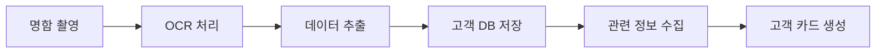
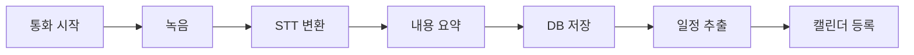

# 분석/설계서 (Story/Design)

## 1. 사용자 스토리

### 영업사원 스토리

1. 명함 등록
   ```
   As a 영업사원
   I want to 명함을 촬영하여 고객 정보를 등록하고
   So that 수작업 입력 없이 고객 DB를 구축할 수 있다
   ```

2. 고객사 정보 조회
   ```
   As a 영업사원
   I want to 고객사 관련 최신 뉴스와 정보를 자동으로 받아보고
   So that 고객과의 대화 주제를 준비할 수 있다
   ```

3. 통화 기록
   ```
   As a 영업사원
   I want to 통화 내용이 자동으로 기록되고 요약되어
   So that 중요한 내용을 놓치지 않고 기억할 수 있다
   ```

4. 일정 관리
   ```
   As a 영업사원
   I want to 통화 중 언급된 약속이 자동으로 일정에 등록되고
   So that 수동으로 일정을 입력할 필요가 없다
   ```

### 관리자 스토리

1. 데이터 관리
   ```
   As a 관리자
   I want to 전체 고객 데이터를 효율적으로 관리하고
   So that 데이터 품질을 유지할 수 있다
   ```

2. 시스템 모니터링
   ```
   As a 관리자
   I want to 시스템 사용 현황과 성능을 모니터링하고
   So that 서비스 품질을 유지할 수 있다
   ```

## 2. 화면 설계

### 메인 대시보드
```
┌─────────────────────────────────────┐
│ [헤더] 로고 / 검색 / 알림 / 프로필  │
├─────────────┬───────────┬──────────┤
│ 오늘의 일정 │ 새로운    │ 빠른     │
│            │ 리포트    │ 작업     │
├─────────────┴───────────┴──────────┤
│                                    │
│ [최근 고객 카드]                   │
│ ┌────────┐ ┌────────┐ ┌────────┐  │
│ │고객 1  │ │고객 2  │ │고객 3  │  │
│ └────────┘ └────────┘ └────────┘  │
│                                    │
├────────────────────────────────────┤
│ [활동 타임라인]                    │
│                                    │
└────────────────────────────────────┘
```

### 고객 카드 상세
```
┌────────────────────────────────────┐
│ [고객 기본 정보]                   │
│ 이름 / 회사 / 직책 / 연락처        │
├────────────────────────────────────┤
│ [최근 활동]                        │
│ - 통화 기록                        │
│ - 일정 내역                        │
│ - 관련 뉴스                        │
├────────────────────────────────────┤
│ [빠른 작업]                        │
│ 전화 / 이메일 / 일정 등록          │
└────────────────────────────────────┘
```

## 3. 데이터 흐름도

### 명함 등록 프로세스


### 통화 기록 프로세스


## 4. API 설계

### RESTful API 엔드포인트

#### 고객 관리 API
```yaml
/api/v1/contacts:
  get:
    summary: 고객 목록 조회
  post:
    summary: 새 고객 등록
  
/api/v1/contacts/{id}:
  get:
    summary: 고객 상세 조회
  put:
    summary: 고객 정보 수정
  delete:
    summary: 고객 삭제
```

#### 통화 관리 API
```yaml
/api/v1/calls:
  post:
    summary: 통화 기록 등록
  get:
    summary: 통화 목록 조회

/api/v1/calls/{id}/summary:
  get:
    summary: 통화 요약 조회
```

## 5. 보안 설계

### 인증 체계
- JWT 기반 인증
- OAuth2.0 소셜 로그인 지원
- 역할 기반 접근 제어 (RBAC)

### 데이터 보안
- 전송 구간 암호화 (TLS)
- 저장 데이터 암호화
- 개인정보 마스킹

## 6. 테스트 계획

### 단위 테스트
- 각 컴포넌트별 기능 테스트
- API 엔드포인트 테스트
- 데이터 유효성 검증

### 통합 테스트
- 전체 워크플로우 테스트
- 외부 서비스 연동 테스트
- 성능/부하 테스트

### 사용자 테스트
- 주요 사용 시나리오 테스트
- UI/UX 사용성 테스트
- 실사용자 피드백 수집